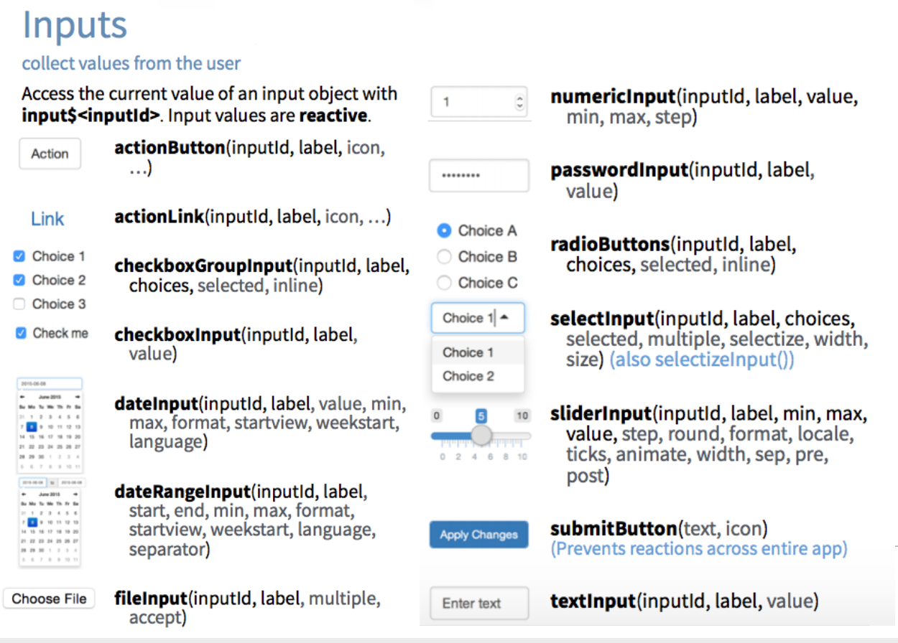
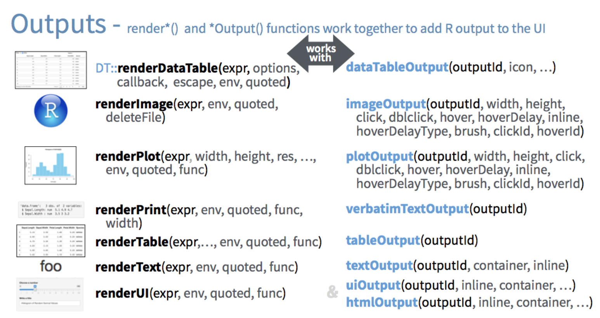
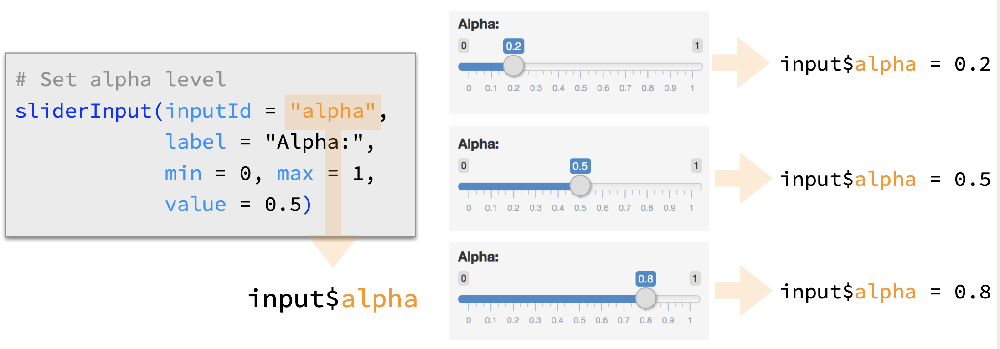

<style>
table,
.table-condensed,
table.rmdtable {
  width: auto;
  margin-left: auto;
  margin-right: auto;
}
table,
.table-condensed,
table.rmdtable,
table.rmdtable .header th,
.table > thead > tr > th {
  border-collapse: collapse;
  border-style: solid;
  border-spacing: 0;
  border-width: medium 0 medium 0;
  border-color: inherit
}
table.rmdtable th,
table.rmdtable td,
table th,
table.rmdtable tr > td:first-child,
table.rmdtable .even {
  font-size: 100%;
  padding: 0em 0.5em;
  color: inherit;
  background: #FFF;
  font-weight: normal;
}
.table > tbody > tr > td {
  border-width: 0;
}
</style>

```{r setup, echo=FALSE, results='hide', message=FALSE, warning=FALSE, error=FALSE}
library(kableExtra)
```

## Shiny

>> Shiny is an R package that makes it easy to build interactive web apps straight from R. You can host standalone apps on a webpage or embed them in R Markdown documents or build dashboards. You can also extend your Shiny apps with CSS themes, htmlwidgets, and JavaScript actions. (shiny.rstudio.com)


## What's in a Shiny app?

```{r, eval=FALSE}
library(shiny)

ui <- fluidPage()

server <- function(input, output, session) { }

shinyApp(ui = ui, server = server)
```

### Or as three files...

* `global.R` - R code that is executed when the app starts.
* `ui.R` - Defines the user interface.
* `server.R` - Defines the "business" logic (i.e. generate plots, tables, etc.)

## `global.R`

```{r, eval=FALSE}
library(shiny)
library(tidverse)

# Load data
data('faithful')
```

## `ui.R`

```{r, eval=FALSE}
shinyUI(fluidPage(
    titlePanel("Old Faithful Geyser Data"),
    sidebarLayout(
        sidebarPanel(
            sliderInput("bins",
                        "Number of bins:",
                        min = 1,
                        max = 50,
                        value = 30)
        ),
        mainPanel(
            plotOutput("distPlot")
        )
    )
))
```

## `server.R`

```{r, eval=FALSE}
shinyServer(function(input, output) {
    output$distPlot <- renderPlot({
        x    <- faithful[, 2]
        bins <- seq(min(x), max(x), length.out = input$bins + 1)
        hist(x, breaks = bins, col = 'darkgray', border = 'white')

    })
})
```


## {.center}



Source: [Shiny Cheat Sheet](https://shiny.rstudio.com/images/shiny-cheatsheet.pdf)


## {.center}



Source: [Shiny Cheat Sheet](https://shiny.rstudio.com/images/shiny-cheatsheet.pdf)

## Reactions

The `input$` list stores the current value of each input object under its name.




## Formatting Text

Shiny Function  | HTML Equivalent  | Creates
----------------|------------------|--------------------------------------------
`p`             | `<p> `             | A paragraph of text
`h1`            | `<h1>`             | A first level header
`h2`            | `<h2>`             | A second level header
`h3`            | `<h3>`             | A third level header
`h4`            | `<h4>`             | A fourth level header
`h5`            | `<h5>`             | A fifth level header
`h6`            | `<h6>`             | A sixth level header
`a`             | `<a>`              | A hyper link (need `href` parameter)  
`br`            | `<br>`             | A line break
`div`           | `<div>`            | A division of text with a uniform style
`pre`           | `<pre>`            | Unformatted text
`code`          | `<code>`           | A formatted block of code
`img`           | ``            | An image (need `src` parameter)
`strong`        | `<strong>`         | Bold text
`em`            | `<em>`             | Italicized text
`HTML`          |                    | HTML code passed directly to the browser


## Including R code in while running the app


```{r, eval=FALSE}
runApp(display.mode="showcase")
```


## Additional Resources

* [RStudio Shiny Tutorials](https://shiny.rstudio.com/tutorial/)
* [Shiny Cheat Sheet](https://shiny.rstudio.com/images/shiny-cheatsheet.pdf)
* [Shiny Gallary](https://shiny.rstudio.com/gallery/)

